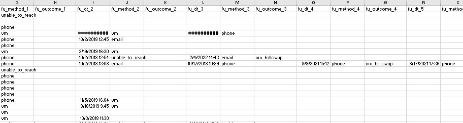
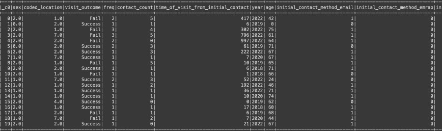

# You and U.S. Research Program: Optimizing Recruitment 

## Overview:
[Google Slides](https://docs.google.com/presentation/d/1137s3_O7ktF4cMPk-cHCNadZev04o0CW/edit?usp=sharing&ouid=103298195738654763321&rtpof=true&sd=true)
This dataset is modeled after recruitment data for an National Insitutes of Health (NIH) research program called You and U.S.(de-identified name). You and U.S., playfully called You and Us, is an ambitious research program asking one million or more people from across the country to participate. Participating includes enrolling online and completing an in-person visit at a local site. Participants share a wealth of personal data in an attempt to capture information about the whole person. Data comes from a range of sources including medical records, biosamples, self-reported surveys, and in-person assessments. 

You and U.S. will ultimately be the largest research data and biorepository in U.S. history and will be leveraged to answer future research questions related to personalized medicine. 

As an enrollment location, the ultimate goal is to 'complete' in-person research visits as funding is directly tied to this metric. However, the most efficient approach to achieving this end goal is less clear. The typical process to recruit someone starts with an email invitation. The email is followed up by up to 5 contacts in an attempt to schedule the prospective participant for a research visit. Generally, 10% of those contacted to participate schedule a research visit. Of those that schedule a visit, only 50% go on to complete the in-person visit. 

### Objective of this Analysis:
The goal of this analysis is to determine if there is an identifiable pattern that leads to completion of the research visit. There are a number of questions that we aim to explore in this analysis:
 1. What are the predictors for a completed visit? Age, location, number of follow-up contacts, method of contact?
 2. For phone outreach, is there an ideal time of day to call (when do people answer the phone)?
 3. For completed visits, is there a rank order to day of the week this happens and does this vary by location?

### Data Source:
This data is sourced from the research endeavor at UC Davis Health and has been completely de-identified. No locations or personal information (for staff or particpants) is included in the csv file. Each row has been assigned a random alphanumeric code that is not traceable to any actual data; all physical locations have been coded with numbers. Information regarding the variables is included in an additional csv file located in the Resources folder on github.  

### Dataset From AWS(Cleaned Database):

### Communication Protocols:
We have opted to collaborate closely on all aspects of the group project but each team member will take lead on a fundamental deliverable. Our plan is as follows:
 - Skye Stewart will lead the presentation componenent of the project. She intends to use Tableau to share the project visually.
 - Hunter Matthews will oversee the GitHub repository and ensure that all team members commit and review regularly. Hunter will ultimately approve the final documents/sources that are committed to the main branch.
 - Louis Martin is charged with developing and implementing the machine learning model.
 - Sedigh Etoumi will manage the database component and support connecting the raw data with the machine learning model.

### Machine Learning Model:
Given that we have an outcome, we expect to use a supervised machine learning model. Further, the outcome is discrete (complete vs. incomplete) and as such, we will use a classification model. Logistic regression is used to solve classification problems. We will start with a Random Forest Classifier model. 

## Please refer to running_with_ml_code.ipynb for the current working file. 
### A summary of our process:
- 1. We started with a significant amount of preprocessing. Mulitple rows existed for the same individual. As such, we aggregated multiple entries for the same individual into a single row containing all relevant information. 
- 2. Next, we used existing column data to calculate new columns in an analyzeable format. This includes calculated a person's age, how far in the future a visit was scheudled, how many times a visit was scheduled, and so on. This allowed us to investigate who was showing up for a visit and to determine if communication mode and frequency impacts whether an individiual will show up for the scheduled visit. 
- 3. Sklearn train test split was used to stratify data because our show rates (i.e., completed visit) is relatively low. 
- 4. The Random Forest Model was selected because we had a defined outcome that was discrete. Additionally, Random Forest Classifer models are resilient to being overfit.  
