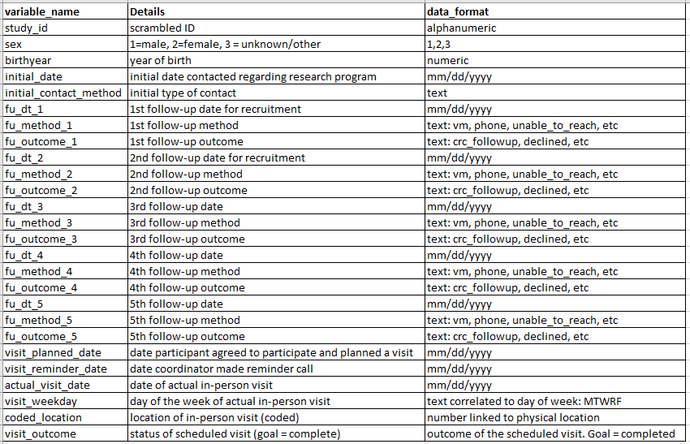

# The You and U.S. Research Program

## Overview:

This dataset is modeled after recruitment data for a national research program called The You and U.S. Research Program (de-identified name). You and U.S., playfully called You and Us, is an ambitious research program asking one million or more people from across the country to participate. Participating includes enrolling online and completing an in-person visit at a local site. The ultimate goal for sites is to 'complete' research visits for participants. Recruitment from initial contact to prospective participants to completed visit can be a long journey. For this analysis, the research manager is eager to understand how to help her team work more effectively and efficiently. 

The data we're reviewing includes outreach efforts to prospective participants. Individuals are contacted multiple times with the ultimate goal from the recruiters stanpoint that the prospect completes an in-person research visit. There are many steps along this journey and people drop-off at many points. There is an initial contact, typically mass email, followed by additional contact points until a visit is scheduled and completes a research visit.

## Cleaning that remains:
Important to note that one participant may have multiple rows if they rescheduled their visit. Not sure if they need to be merged as one row for our analysis/model?

## Brainstorming Questions:

1. Is it worth leaving a voicemail? How often does a voicemail left lead to another follow-up contact or scheduled visit?
2. What are the predictors for completed visit? Age, location, number of contact?
3. Is there an ideal day or time of day to call prospectives?

## Variable Info:

